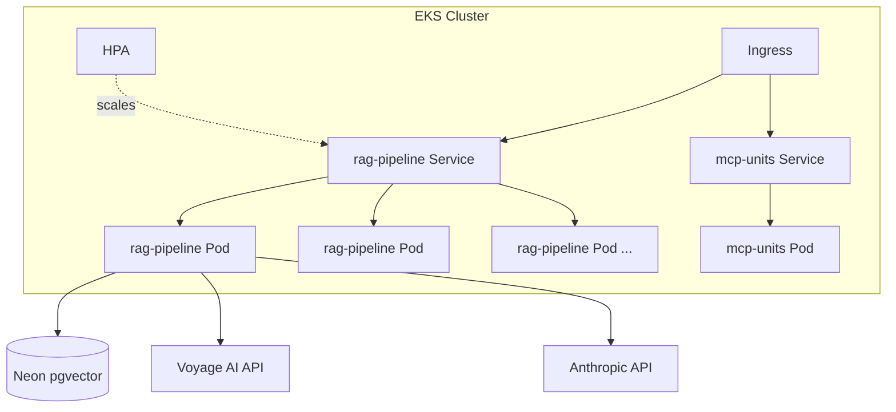

# k8s-deploy

Deploys a RAG pipeline and MCP server to Kubernetes — same Helm charts run locally on kind and in production on EKS.

## What this does

Deploys two services to Kubernetes:

- **[rag-pipeline](https://github.com/quantumleeps/rag-pipeline)** — FastAPI service for querying EPA water treatment regulations via RAG (pgvector + LlamaIndex + Voyage AI embeddings). Full Helm chart with HPA, Ingress, ConfigMap/Secret separation, and optional pgvector StatefulSet.
- **[mcp-units](https://github.com/quantumleeps/mcp-units)** — MCP server for unit conversions. Simple Deployment + Service.

Both run locally on kind and in production on EKS — the same Helm charts with different values overrides handle environment promotion. Terraform provisions the AWS infrastructure. GitHub Actions handles CI (lint + kind integration test) and CD (manual deploy to EKS).

## Architecture



## Demo

Both services running on EKS with HPA autoscaling:


RAG query answering EPA water treatment questions (EKS pod → Voyage AI → Neon pgvector → Claude):


942 indexed document chunks in Neon managed pgvector:


HPA scaling replicas during Locust load test on kind:


MCP units server accessed from Claude Desktop via ngrok tunnel:

https://github.com/user-attachments/assets/179e4e38-c2a1-46e4-a73a-d8c7067eb21f

## How it works

Helm charts use a values override pattern for environment promotion:

- `values.yaml` — defaults
- `values-local.yaml` — kind: internal pgvector StatefulSet, nginx ingress, smaller resources
- `values-eks.yaml` — EKS: external Neon DB, ALB ingress, production resources

The `database.mode` toggle (`internal` vs `external`) controls whether pgvector runs as a StatefulSet inside the cluster or connects to a managed database outside it.

## Quickstart

### Local (kind)

Requires: Docker, kind, kubectl, helm

```bash
# One-command setup: creates cluster, installs ingress + metrics-server,
# builds images, deploys both charts
export VOYAGE_API_KEY=your-key
export ANTHROPIC_API_KEY=your-key
bash kind/setup.sh

# Verify
kubectl get pods
curl http://localhost/health
```

### AWS (EKS)

Requires: AWS CLI, terraform, kubectl, helm

**Warning: This creates AWS resources that cost money (~$5-7/day). Remember to destroy when done.**

```bash
# Provision infrastructure
cd terraform
cp terraform.tfvars.example terraform.tfvars  # edit as needed
terraform init && terraform apply

# Configure kubectl
$(terraform output -raw configure_kubectl)

# Build and push images to ECR
RAG_ECR=$(terraform output -raw ecr_rag_pipeline_url)
MCP_ECR=$(terraform output -raw ecr_mcp_units_url)
aws ecr get-login-password | docker login --username AWS --password-stdin "${RAG_ECR%/*}"

docker build -t "$RAG_ECR:latest" /path/to/rag-pipeline
docker push "$RAG_ECR:latest"

docker build -t "$MCP_ECR:latest" /path/to/mcp-units
docker push "$MCP_ECR:latest"

# Deploy both services
cd ..
helm install rag charts/rag-pipeline \
  -f charts/rag-pipeline/values-eks.yaml \
  --set image.repository="$RAG_ECR" \
  --set database.host="$NEON_HOST" \
  --set secrets.POSTGRES_PASSWORD="$NEON_PASSWORD" \
  --set secrets.VOYAGE_API_KEY="$VOYAGE_API_KEY" \
  --set secrets.ANTHROPIC_API_KEY="$ANTHROPIC_API_KEY"

helm install mcp charts/mcp-units \
  --set image.repository="$MCP_ECR"

# Tear down when done
cd terraform && terraform destroy
```

## Project structure

```
k8s-deploy/
├── charts/
│   ├── rag-pipeline/       Helm chart (Deployment, Service, Ingress,
│   │   ├── templates/      HPA, ConfigMap, Secret, StatefulSet)
│   │   ├── values.yaml
│   │   ├── values-local.yaml
│   │   └── values-eks.yaml
│   └── mcp-units/          Simple Deployment + Service chart
├── kind/
│   ├── cluster.yaml        3-node cluster config
│   └── setup.sh            One-command local setup
├── terraform/              EKS + VPC + ECR (terraform-aws-modules)
├── load-test/              Locust load tests for HPA measurement
└── .github/workflows/
    ├── ci.yaml             Lint + kind integration test on PR
    └── deploy.yaml         Manual deploy to EKS
```

## Next steps

- **Service mesh** (Linkerd) — mTLS between services, traffic splitting, per-route observability
- **GitOps** (ArgoCD) — declarative deployments from git, automatic drift detection and reconciliation
- **External secrets operator** — pull API keys from AWS Secrets Manager instead of Helm `--set`
- **Network policies** (Cilium) — restrict pod-to-pod traffic to only what's needed
- **Observability stack** (Prometheus + Grafana) — cluster and application metrics, dashboards, alerting
- **Progressive delivery** (Argo Rollouts) — canary deployments with automated rollback

## Contributing

PRs welcome. Run `pre-commit install` after cloning and ensure `helm lint charts/*` passes before submitting.

## License

MIT
